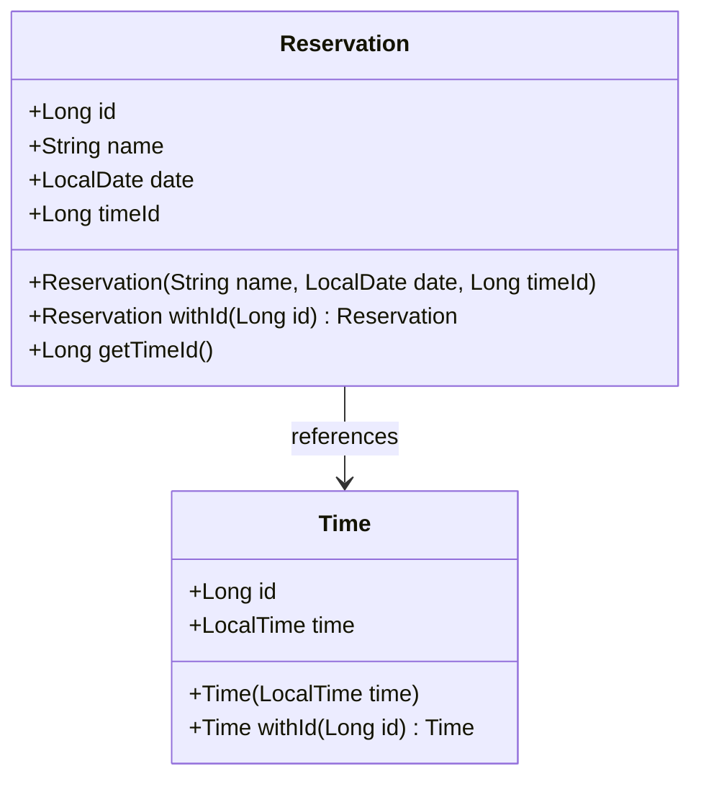

# 🗝 방탈출 예약 시스템 (Spring MVC)

## 🎯 프로젝트 개요

### 🏠 홈 화면
- 관리자 전용 홈 페이지입니다.
- 좌측 사이드바에서 페이지를 이동할 수 있습니다.
- `/` 경로로 접속 시 홈 화면(`index.html`)이 렌더링됩니다.

### 📅 예약 관리
- 등록된 예약 목록을 확인할 수 있습니다.
- 이름, 날짜, 시간별로 정리되어 보여집니다.
- 새로운 예약을 이름, 날짜, 시간을 입력하여 등록할 수 있습니다.
- 기존 예약을 선택하여 삭제할 수 있습니다.
- `/reservation` 경로로 접속 시 예약 관리 화면(`new-reservation.html`)이 렌더링됩니다.

### ⏰ 시간 관리
- 등록된 시간 목록을 확인할 수 있습니다.
- 새로운 시간을 입력하여 등록할 수 있습니다.
- 기존 시간을 선택하여 삭제할 수 있습니다.
- `/time` 경로로 접속 시 시간 관리 화면(`time.html`)이 렌더링됩니다.

---

## 📜 API 문서
### 🛠 엔드포인트 요약

| 메서드    | 경로                   | 설명           | 요청 본문             | 응답 코드          |
| ------ | -------------------- | ------------ | ----------------- | -------------- |
| GET    | `/reservations`      | 모든 예약 목록 조회  | 없음                | 200 OK         |
| POST   | `/reservations`      | 새 예약 생성      | JSON (이름, 날짜, 시간) | 201 Created    |
| DELETE | `/reservations/{id}` | 지정된 예약 삭제    | 없음                | 204 No Content |
| GET    | `/times`             | 등록된 시간 목록 조회 | 없음                | 200 OK         |
| POST   | `/times`             | 새 시간 등록      | JSON (시간)         | 201 Created    |
| DELETE | `/times/{id}`        | 지정된 시간 삭제    | 없음                | 204 No Content |


### 📋 엔드포인트 상세

#### 1. 예약 목록 조회

- **메서드**: `GET`
- **경로**: `/reservations`
- **타입**: `application/json`
- **설명**: 등록된 모든 예약을 반환합니다.
- **응답**:
    - 상태 코드: `200 OK`
    - 본문:
```json
[
  {
    "id": 1,
    "name": "브라운",
    "date": "2023-01-01",
    "time": "10:00"
  },
  {
    "id": 2,
    "name": "브라운",
    "date": "2023-01-02",
    "time": "11:00"
  }
]
```
---
#### 2. 예약 생성

- **메서드**: `POST`
- **경로**: `/reservations`
- **타입**: `application/json`
- **요청**
```json
{
  "date": "2023-08-05",
  "name": "브라운",
  "time": "15:40"
}
```
- **응답**:
    - 상태 코드: `201 Created`
    - 헤더: `Loaction: /reservation/1`
    - **타입**: `application/json`
    - 본문:
```json
{
  "id": 1,
  "name": "브라운",
  "date": "2023-08-05",
  "time": "15:40"
}
```
---
#### 3. 예약 삭제

- **메서드**: `DELETE`
- **경로**: `/reservations/{id}`
- **타입**: `application/json`
- **응답**:
  - 상태 코드: `204 No Content`
  - 본문 없음
---
#### 4. 시간 목록 조회

- **메서드**: `GET`
- **경로**: `/times`
- **타입**: `application/json`
- **설명**: 등록된 모든 시간을 반환합니다.
- **응답**:
    - 상태 코드: `200 OK`
    - 본문:
```json
[
  {
    "id": 1,
    "time": "10:00"
  },
  {
    "id": 2,
    "time": "11:30"
  }
]
```
---
#### 5. 시간 등록

- **메서드**: `POST`
- **경로**: `/times`
- **타입**: `application/json`
- **요청**
```json
{
  "time": "14:00"
}
```
- **응답**:
    - 상태 코드: `201 Created`
    - 헤더: `Loaction: /times/1`
    - **타입**: `application/json`
    - 본문:
```json
{
  "id": 1,
  "time": "14:00"
}
```
---
#### 6. 시간 삭제

- **메서드**: `DELETE`
- **경로**: `/times/{id}`
- **타입**: `application/json`
- **응답**:
    - 상태 코드: `204 No Content`
    - 본문 없음

---
## 📝 참고사항


**Domain Model**



### 데이터 형식
- `date`: `YYYY-MM-DD` (예: `2025-05-10`)
- `time`: `HH:MM` (예: `14:00`)

### 검증 조건
- 이름: `@NotBlank`
- 날짜: `@NotNull`
- 시간: `@NotNull`

### ID 관리
- 기본 키는 AUTO_INCREMENT 방식으로 관리
- SimpleJdbcInsert를 통해 데이터베이스에서 자동으로 생성된 값을 받아와 사용

